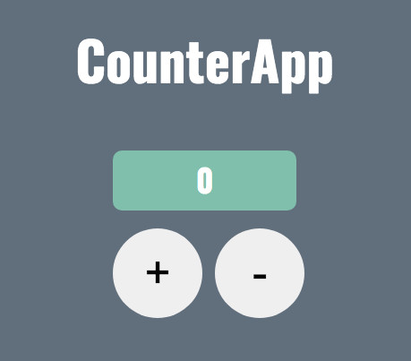

  <h1 align="center">
    CounterApp
  </h1>
  <h3 align="center">
      
    <br>
  <br>
    <a href="https://counterapp-459a3.web.app/">Live Preview</a>
  </h3>

## The Project

CounterApp is a simple counter program that increases and decreases the number based on the user's selection.
<br>
<br>
The program begins by defining the functions myUpFunction () and myDownFunction () to increase and decrease the number set in the variable.
<br>
<br>
The functions are called through an event listener (addEventListener) which, according to the button clicked by the user, increases or decreases the displayed number.


## Built With

* ```HTML```
* ```CSS```
* ```JAVASCRIPT```


## Link

Project Link: <a href="https://counterapp-459a3.web.app/">https://counterapp-459a3.web.app/</a>
